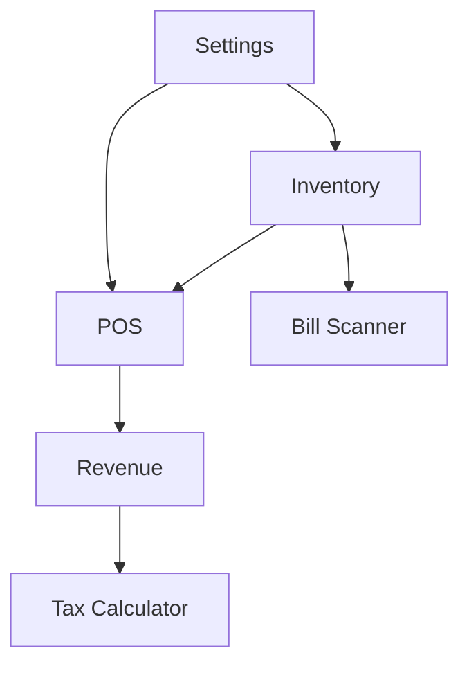

# 🎯 Feature Specifications

## Overview

This document provides detailed specifications for each feature in the Chợ Số POS application.

---

## 📦 Feature 1: Inventory Management (Kho sản phẩm)

### 1.1 Description
Complete product inventory management system allowing vendors to add, edit, delete, and track products in their store.

### 1.2 User Stories

| ID | As a... | I want to... | So that... |
|----|---------|--------------|------------|
| INV-01 | Vendor | Add a new product with name, price, unit, and quantity | I can sell it to customers |
| INV-02 | Vendor | Edit product details | I can update prices or fix mistakes |
| INV-03 | Vendor | Delete products | I can remove items I no longer sell |
| INV-04 | Vendor | Quickly adjust stock (+/-) | I can update after restocking |
| INV-05 | Vendor | See low stock warnings | I know when to reorder |
| INV-06 | Vendor | Filter products by category | I can find items faster |
| INV-07 | Vendor | Search products | I can quickly find specific items |
| INV-08 | Vendor | See total inventory value | I know my business worth |

### 1.3 Screen Layout (Tablet)

```
┌─────────────────────────────────────────────────────────────────┐
│ [Sidebar 280px]  │ [Main Content Area]                          │
│                  │                                               │
│  🏪 Chợ Số       │  ┌─ Header ─────────────────────────────────┐│
│                  │  │ Quản lý Kho sản phẩm    [Search] [👤]    ││
│  ○ Bán hàng      │  └──────────────────────────────────────────┘│
│  ● Kho sản phẩm  │                                               │
│  ○ Nhập hóa đơn  │  [Tất cả] [Trái cây] [Rau củ] [+Thêm SP]     │
│  ○ Doanh thu     │                                               │
│  ○ Tính thuế     │  ┌──────┐ ┌──────┐ ┌──────┐ ┌──────┐        │
│                  │  │ Card │ │ Card │ │ Card │ │ Card │        │
│  ───────────     │  │      │ │      │ │      │ │      │        │
│  👤 Cô Lan       │  └──────┘ └──────┘ └──────┘ └──────┘        │
│                  │                                               │
│                  │  ┌─ Footer (Stats Bar) ─────────────────────┐│
│                  │  │ 💰 Tổng giá trị: 187,435,000đ  │ 📦 120  ││
│                  │  └──────────────────────────────────────────┘│
└─────────────────────────────────────────────────────────────────┘
```

### 1.4 Product Card Design

```
┌─────────────────────────────────┐
│ [Trái cây]              [•••]  │  <- Category badge, more menu
│                                 │
│ Táo Envy Mỹ                     │  <- Product name
│ 150.000đ / Kg                   │  <- Price with unit
│                                 │
│ ┌─────────────────────────────┐│
│ │ TỒN KHO (Kg)                ││
│ │ 50          [-] [+]         ││  <- Quick stock adjust
│ └─────────────────────────────┘│
│                                 │
│ [  ✏️ Sửa  ] [  🗑️ Xóa  ]      │  <- Action buttons
└─────────────────────────────────┘
```

### 1.5 Add/Edit Product Dialog

```
┌─────────────────────────────────────────┐
│ Thêm sản phẩm mới                   [X] │
├─────────────────────────────────────────┤
│                                         │
│ Tên sản phẩm *                          │
│ ┌─────────────────────────────────────┐ │
│ │ Nhập tên sản phẩm...                │ │
│ └─────────────────────────────────────┘ │
│                                         │
│ Danh mục                                │
│ ┌─────────────────────────────────────┐ │
│ │ 🥬 Rau củ                      [▼]  │ │
│ └─────────────────────────────────────┘ │
│                                         │
│ Giá bán *              Đơn vị *         │
│ ┌─────────────────┐   ┌───────────────┐ │
│ │ 25,000          │đ  │ Kg       [▼]  │ │
│ └─────────────────┘   └───────────────┘ │
│                                         │
│ Số lượng tồn kho *     Cảnh báo khi     │
│ ┌─────────────────┐   ┌───────────────┐ │
│ │ 50              │   │ 10            │ │
│ └─────────────────┘   └───────────────┘ │
│                                         │
│ Mã vạch (tuỳ chọn)                      │
│ ┌─────────────────────────────────────┐ │
│ │                          [📷 Scan]  │ │
│ └─────────────────────────────────────┘ │
│                                         │
│ Hình ảnh (tuỳ chọn)                     │
│ ┌───────────┐                           │
│ │   📷      │  [Chọn ảnh]               │
│ └───────────┘                           │
│                                         │
│        [Huỷ]           [💾 Lưu]         │
└─────────────────────────────────────────┘
```

### 1.6 Technical Implementation

```
lib/features/inventory/
├── data/
│   └── repositories/
│       ├── inventory_repository.dart
│       └── inventory_repository_impl.dart
├── domain/
│   ├── models/
│   │   ├── product.dart
│   │   ├── category.dart
│   │   └── stock_adjustment.dart
│   ├── repositories/
│   │   └── i_inventory_repository.dart
│   └── usecases/
│       ├── get_products_usecase.dart
│       ├── add_product_usecase.dart
│       ├── update_product_usecase.dart
│       ├── delete_product_usecase.dart
│       └── adjust_stock_usecase.dart
├── presentation/
│   ├── cubit/
│   │   ├── inventory_cubit.dart
│   │   └── inventory_state.dart
│   ├── screens/
│   │   └── inventory_screen.dart
│   ├── widgets/
│   │   ├── product_card.dart
│   │   ├── add_product_dialog.dart
│   │   ├── category_filter.dart
│   │   └── inventory_stats_bar.dart
│   └── routes/
│       └── inventory_route.dart
└── inventory_inject.dart
```

---

## 🛒 Feature 2: Point of Sale (Bán hàng POS)

### 2.1 Description
Main selling interface allowing vendors to quickly add products to cart, manage orders, and complete sales.

### 2.2 User Stories

| ID | As a... | I want to... | So that... |
|----|---------|--------------|------------|
| POS-01 | Vendor | Search products by name | I can quickly add items to cart |
| POS-02 | Vendor | Scan barcode to add product | I can speed up the checkout process |
| POS-03 | Vendor | Browse products by category | I can find items visually |
| POS-04 | Vendor | Add/remove items from cart | I can build the order correctly |
| POS-05 | Vendor | Adjust item quantity in cart | I can fix mistakes quickly |
| POS-06 | Vendor | See cart total in real-time | I can inform customer of cost |
| POS-07 | Vendor | Add customer info (optional) | I can track regular customers |
| POS-08 | Vendor | Complete the sale | I can finalize the transaction |
| POS-09 | Vendor | Apply discounts | I can offer special prices |

### 2.3 Screen Layout (Tablet - Split View)

```
┌─────────────────────────────────────────────────────────────────────────────┐
│ [Sidebar]  │ [Product Grid]                              │ [Cart Panel]     │
│ 280px      │ ~60%                                        │ 420px            │
│            │                                              │                  │
│            │ ┌─ Header ─────────────────────────────────┐│ ┌─ Order ──────┐│
│            │ │ Bán hàng  [🔍 Tìm sản phẩm...] [🔔] [⟳] ││ │ #1023    NEW ││
│            │ └──────────────────────────────────────────┘│ │ 👤 Khách lẻ  ││
│            │                                              │ └──────────────┘│
│            │ [Tất cả] [🥬 Rau củ] [🥩 Thịt cá] [🥚]      │                  │
│            │                                              │ ┌─ Items ─────┐│
│            │ ┌──────┐ ┌──────┐ ┌──────┐ ┌──────┐        │ │ Cà chua      ││
│            │ │ 🍅   │ │ 🥬   │ │ 🥩   │ │ 🥚   │        │ │ 2kg × 25k   ││
│            │ │ Cà   │ │ Rau  │ │ Thịt │ │ Trứng│        │ │ = 50,000đ   ││
│            │ │ chua │ │muống │ │ba chỉ│ │ gà   │        │ │ [-] 2 [+]   ││
│            │ │ 25k  │ │ 10k  │ │ 140k │ │ 35k  │        │ ├─────────────┤│
│            │ │  [+] │ │  [+] │ │  [+] │ │  [+] │        │ │ Rau muống   ││
│            │ └──────┘ └──────┘ └──────┘ └──────┘        │ │ 1bó × 10k   ││
│            │                                              │ │ = 10,000đ   ││
│            │ ┌──────┐ ┌──────┐ ┌──────┐ ┌──────┐        │ └─────────────┘│
│            │ │      │ │      │ │      │ │      │        │                  │
│            │ │ ...  │ │ ...  │ │ ...  │ │ ...  │        │ ┌─ Summary ────┐│
│            │ │      │ │      │ │      │ │      │        │ │ Tạm tính:    ││
│            │ └──────┘ └──────┘ └──────┘ └──────┘        │ │  60,000đ     ││
│            │                                              │ │              ││
│            │                                              │ │ TỔNG CỘNG:  ││
│            │                                              │ │ 60,000đ     ││
│            │                                              │ └──────────────┘│
│            │                                              │                  │
│            │                                              │ [   THANH TOÁN  ]│
│            │                                              │      60,000đ     │
└─────────────────────────────────────────────────────────────────────────────┘
```

### 2.4 Product Card (POS Grid)

```
┌─────────────────────────────────┐
│ ┌─────────────────────────────┐ │
│ │                             │ │
│ │      [Product Image]        │ │
│ │                             │ │
│ └─────────────────────────────┘ │
│                                 │
│ Cà chua                         │
│                                 │
│ 25.000đ /kg          [  +  ]    │
└─────────────────────────────────┘
```

### 2.5 Cart Item Design

```
┌──────────────────────────────────────┐
│ [📷] Cà chua                 50,000đ │
│      25,000đ / kg                    │
│                    [-] [2] [+] [🗑️]  │
└──────────────────────────────────────┘
```

### 2.6 Checkout Flow

```
1. Build Cart -> 2. Review Order -> 3. Payment -> 4. Confirmation

┌─ Payment Dialog ────────────────────┐
│ Thanh toán đơn hàng #1023       [X] │
├─────────────────────────────────────┤
│                                     │
│ TỔNG TIỀN                           │
│ ┌─────────────────────────────────┐ │
│ │           60,000đ               │ │
│ └─────────────────────────────────┘ │
│                                     │
│ Phương thức thanh toán              │
│ ┌─────────┐ ┌─────────┐ ┌────────┐ │
│ │  💵     │ │  🏦     │ │  📱   │ │
│ │ Tiền    │ │ Chuyển  │ │ MoMo  │ │
│ │ mặt    ●│ │ khoản   │ │       │ │
│ └─────────┘ └─────────┘ └────────┘ │
│                                     │
│ Khách đưa                           │
│ ┌─────────────────────────────────┐ │
│ │ 100,000                         │ │
│ └─────────────────────────────────┘ │
│                                     │
│ [50k] [100k] [200k] [500k] [Đủ]     │
│                                     │
│ Tiền thừa: 40,000đ                  │
│                                     │
│      [Huỷ]        [✓ Xác nhận]      │
└─────────────────────────────────────┘
```

### 2.7 Technical Implementation

```
lib/features/pos/
├── data/
│   └── repositories/
│       ├── order_repository.dart
│       └── cart_repository.dart
├── domain/
│   ├── models/
│   │   ├── order.dart
│   │   ├── order_item.dart
│   │   └── cart.dart
│   ├── repositories/
│   │   └── i_order_repository.dart
│   └── usecases/
│       ├── add_to_cart_usecase.dart
│       ├── update_cart_item_usecase.dart
│       ├── remove_from_cart_usecase.dart
│       ├── create_order_usecase.dart
│       └── complete_payment_usecase.dart
├── presentation/
│   ├── cubit/
│   │   ├── pos_cubit.dart
│   │   ├── pos_state.dart
│   │   ├── cart_cubit.dart
│   │   └── cart_state.dart
│   ├── screens/
│   │   └── pos_screen.dart
│   ├── widgets/
│   │   ├── product_grid.dart
│   │   ├── product_card_pos.dart
│   │   ├── cart_panel.dart
│   │   ├── cart_item_tile.dart
│   │   ├── payment_dialog.dart
│   │   └── order_summary.dart
│   └── routes/
│       └── pos_route.dart
└── pos_inject.dart
```

---

## 📊 Feature 3: Revenue Tracking (Doanh thu)

### 3.1 Description
Sales analytics and reporting dashboard to help vendors track their business performance.

### 3.2 User Stories

| ID | As a... | I want to... | So that... |
|----|---------|--------------|------------|
| REV-01 | Vendor | See today's revenue | I know how well I'm doing |
| REV-02 | Vendor | View revenue by date range | I can analyze trends |
| REV-03 | Vendor | See top selling products | I know what to stock more |
| REV-04 | Vendor | View hourly sales pattern | I know busy times |
| REV-05 | Vendor | Compare periods | I can track growth |
| REV-06 | Vendor | Export reports | I can keep records |

### 3.3 Screen Layout

```
┌─────────────────────────────────────────────────────────────────┐
│ [Sidebar]  │ [Main Content]                                     │
│            │                                                     │
│            │ ┌─ Header ─────────────────────────────────────────┐│
│            │ │ Doanh thu        [Hôm nay ▼] [📅 Chọn ngày]     ││
│            │ └──────────────────────────────────────────────────┘│
│            │                                                     │
│            │ ┌─ Summary Cards ──────────────────────────────────┐│
│            │ │ ┌─────────────┐ ┌─────────────┐ ┌─────────────┐ ││
│            │ │ │ 💰 Doanh thu│ │ 🛒 Đơn hàng │ │ 📦 Sản phẩm │ ││
│            │ │ │ 2,450,000đ  │ │ 45          │ │ 128         │ ││
│            │ │ │ ▲ +12%      │ │ ▲ +5%       │ │ ▲ +8%       │ ││
│            │ │ └─────────────┘ └─────────────┘ └─────────────┘ ││
│            │ └──────────────────────────────────────────────────┘│
│            │                                                     │
│            │ ┌─ Revenue Chart ──────────────────────────────────┐│
│            │ │                    📈                            ││
│            │ │    ╭───╮                                         ││
│            │ │   ╭╯   ╰╮    ╭─╮                                 ││
│            │ │ ╭─╯     ╰────╯ ╰──╮                              ││
│            │ │─╯                 ╰──                            ││
│            │ │ 6h  8h  10h 12h 14h 16h 18h                     ││
│            │ └──────────────────────────────────────────────────┘│
│            │                                                     │
│            │ ┌─ Top Products ────┐ ┌─ Recent Orders ────────────┐│
│            │ │ 1. Cà chua   50kg │ │ #1025  10:30  35,000đ      ││
│            │ │ 2. Rau muống 30bó │ │ #1024  10:15  120,000đ     ││
│            │ │ 3. Thịt     15kg  │ │ #1023  09:45  60,000đ      ││
│            │ └───────────────────┘ └─────────────────────────────┘│
└─────────────────────────────────────────────────────────────────┘
```

### 3.4 Technical Implementation

```
lib/features/revenue/
├── data/
│   └── repositories/
│       └── revenue_repository.dart
├── domain/
│   ├── models/
│   │   ├── daily_revenue.dart
│   │   ├── revenue_summary.dart
│   │   └── top_product.dart
│   └── usecases/
│       ├── get_daily_revenue_usecase.dart
│       ├── get_revenue_range_usecase.dart
│       └── get_top_products_usecase.dart
├── presentation/
│   ├── cubit/
│   │   ├── revenue_cubit.dart
│   │   └── revenue_state.dart
│   ├── screens/
│   │   └── revenue_screen.dart
│   └── widgets/
│       ├── revenue_summary_cards.dart
│       ├── revenue_chart.dart
│       ├── top_products_list.dart
│       └── recent_orders_list.dart
└── revenue_inject.dart
```

---

## 🧮 Feature 4: Tax Calculator (Tính thuế)

### 4.1 Description
Vietnamese tax calculation tool for small business owners to estimate their tax obligations.

### 4.2 Vietnamese Tax Rules for Small Businesses

#### Thuế môn bài (Business License Tax)
| Annual Revenue | Tax Amount |
|---------------|------------|
| > 500 triệu   | 3,000,000đ |
| 300-500 triệu | 2,000,000đ |
| 100-300 triệu | 1,000,000đ |
| < 100 triệu   | 300,000đ   |

#### Thuế TNCN (Personal Income Tax)
Progressive rates for business individuals:
| Taxable Income/Year | Rate |
|--------------------|------|
| 0 - 60 triệu       | 5%   |
| 60 - 120 triệu     | 10%  |
| 120 - 216 triệu    | 15%  |
| 216 - 384 triệu    | 20%  |
| 384 - 624 triệu    | 25%  |
| 624 - 960 triệu    | 30%  |
| > 960 triệu        | 35%  |

### 4.3 Screen Layout

```
┌─────────────────────────────────────────────────────────────────┐
│ [Sidebar]  │ [Main Content]                                     │
│            │                                                     │
│            │ ┌─ Header ─────────────────────────────────────────┐│
│            │ │ Tính thuế             [Tháng ▼] [Năm 2024 ▼]    ││
│            │ └──────────────────────────────────────────────────┘│
│            │                                                     │
│            │ ┌─ Revenue Input ──────────────────────────────────┐│
│            │ │ Doanh thu tháng 12/2024                          ││
│            │ │ ┌──────────────────────────────────────────────┐ ││
│            │ │ │ 45,000,000                               đ   │ ││
│            │ │ └──────────────────────────────────────────────┘ ││
│            │ │ [Lấy từ doanh thu thực tế]                       ││
│            │ └──────────────────────────────────────────────────┘│
│            │                                                     │
│            │ ┌─ Tax Breakdown ──────────────────────────────────┐│
│            │ │                                                   ││
│            │ │ 📋 Thuế môn bài (năm)          1,000,000đ        ││
│            │ │    Doanh thu năm: 540 triệu                      ││
│            │ │                                                   ││
│            │ │ 💰 Thuế TNCN (tạm tính tháng)    2,250,000đ      ││
│            │ │    Thu nhập chịu thuế: 45 triệu × 5%             ││
│            │ │                                                   ││
│            │ │ ─────────────────────────────────────────────    ││
│            │ │ TỔNG THUẾ THÁNG NÀY:            2,250,000đ       ││
│            │ │ THUẾ MÔN BÀI (1 lần/năm):       1,000,000đ       ││
│            │ └──────────────────────────────────────────────────┘│
│            │                                                     │
│            │ ℹ️ Đây là ước tính sơ bộ. Tham khảo cơ quan thuế    │
│            │    để biết chính xác nghĩa vụ thuế.                 │
│            │                                                     │
│            │        [📥 Xuất báo cáo]    [💾 Lưu lịch sử]        │
└─────────────────────────────────────────────────────────────────┘
```

### 4.4 Technical Implementation

```
lib/features/tax_calculator/
├── data/
│   └── repositories/
│       └── tax_repository.dart
├── domain/
│   ├── models/
│   │   ├── tax_calculation.dart
│   │   ├── tax_bracket.dart
│   │   └── tax_record.dart
│   └── usecases/
│       ├── calculate_business_license_tax_usecase.dart
│       ├── calculate_income_tax_usecase.dart
│       └── save_tax_record_usecase.dart
├── presentation/
│   ├── cubit/
│   │   ├── tax_calculator_cubit.dart
│   │   └── tax_calculator_state.dart
│   ├── screens/
│   │   └── tax_calculator_screen.dart
│   └── widgets/
│       ├── revenue_input.dart
│       ├── tax_breakdown.dart
│       └── tax_info_card.dart
└── tax_calculator_inject.dart
```

---

## 📷 Feature 5: Bill Scanner (Nhập từ hóa đơn)

### 5.1 Description
OCR-powered feature to scan supplier invoices and bulk import products into inventory.

### 5.2 User Stories

| ID | As a... | I want to... | So that... |
|----|---------|--------------|------------|
| SCAN-01 | Vendor | Take a photo of supplier bill | I can import products quickly |
| SCAN-02 | Vendor | See extracted product list | I can verify before importing |
| SCAN-03 | Vendor | Edit extracted data | I can fix OCR mistakes |
| SCAN-04 | Vendor | Match to existing products | I can update quantities |
| SCAN-05 | Vendor | Import as new products | I can add new items |

### 5.3 Screen Flow

```
1. Capture Bill -> 2. Processing -> 3. Review & Edit -> 4. Confirm Import

┌─ Step 1: Capture ───────────────────┐
│                                      │
│  ┌────────────────────────────────┐ │
│  │                                │ │
│  │     📷 Camera Preview          │ │
│  │                                │ │
│  │     [Align bill in frame]      │ │
│  │                                │ │
│  └────────────────────────────────┘ │
│                                      │
│  [📁 Chọn từ thư viện]   [📸 Chụp]  │
└──────────────────────────────────────┘

┌─ Step 3: Review ────────────────────┐
│ Xác nhận sản phẩm                   │
├─────────────────────────────────────┤
│                                     │
│ Nhà cung cấp: Chợ đầu mối Thủ Đức   │
│ Ngày: 23/12/2024                    │
│                                     │
│ ┌─ Extracted Items ───────────────┐ │
│ │ ☑ Cà chua       10kg   250,000đ │ │
│ │   → Cập nhật +10kg              │ │
│ │                                 │ │
│ │ ☑ Rau muống     20bó   200,000đ │ │
│ │   → Cập nhật +20bó              │ │
│ │                                 │ │
│ │ ☑ Thịt ba chỉ   5kg    700,000đ │ │
│ │   → Sản phẩm mới                │ │
│ │                                 │ │
│ │ ☐ [Không nhận dạng được]   [Sửa]│ │
│ └─────────────────────────────────┘ │
│                                     │
│ Tổng: 1,150,000đ | 3 sản phẩm       │
│                                     │
│    [Huỷ]          [Nhập vào kho]    │
└─────────────────────────────────────┘
```

### 5.4 Technical Implementation

```
lib/features/bill_scanner/
├── data/
│   └── repositories/
│       └── bill_scanner_repository.dart
├── domain/
│   ├── models/
│   │   ├── bill_import.dart
│   │   ├── extracted_item.dart
│   │   └── import_result.dart
│   └── usecases/
│       ├── capture_bill_usecase.dart
│       ├── process_ocr_usecase.dart
│       ├── match_products_usecase.dart
│       └── import_products_usecase.dart
├── presentation/
│   ├── cubit/
│   │   ├── bill_scanner_cubit.dart
│   │   └── bill_scanner_state.dart
│   ├── screens/
│   │   ├── camera_screen.dart
│   │   └── review_import_screen.dart
│   └── widgets/
│       ├── camera_preview.dart
│       ├── extracted_item_tile.dart
│       └── import_summary.dart
└── bill_scanner_inject.dart
```

---

## ⚙️ Feature 6: Settings & Profile

### 6.1 Description
User profile and app settings management.

### 6.2 Settings Options

- **Profile**: Name, phone, avatar
- **Store Info**: Store name, address
- **Theme**: Light/Dark/System
- **Language**: Vietnamese/English
- **Sync**: Auto-sync, manual sync
- **Data**: Export data, clear cache
- **About**: Version, support

### 6.3 Technical Implementation

```
lib/features/settings/
├── data/
│   └── repositories/
│       └── settings_repository.dart
├── domain/
│   ├── models/
│   │   ├── user_profile.dart
│   │   └── app_settings.dart
│   └── usecases/
│       ├── update_profile_usecase.dart
│       └── update_settings_usecase.dart
├── presentation/
│   ├── cubit/
│   │   ├── settings_cubit.dart
│   │   └── settings_state.dart
│   ├── screens/
│   │   └── settings_screen.dart
│   └── widgets/
│       ├── profile_card.dart
│       └── settings_tile.dart
└── settings_inject.dart
```

---

## 🔗 Feature Dependencies



- **POS** depends on **Inventory** for product data
- **Revenue** depends on **POS** for order data
- **Bill Scanner** updates **Inventory**
- **Tax Calculator** uses **Revenue** data
- **Settings** affects all features
